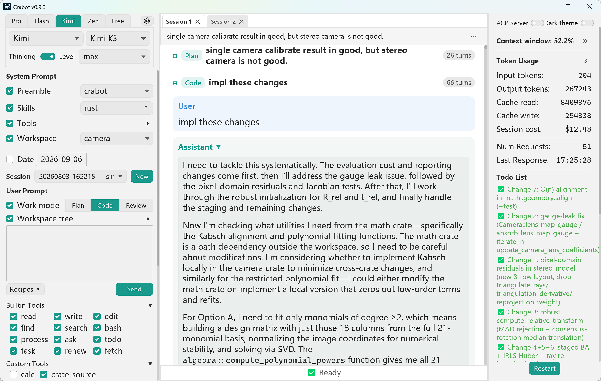

# Crabot

[](https://crates.io/crates/crabot)
[](https://crates.io/crates/crabot)
[](https://github.com/J-F-Liu/crabot/actions/workflows/rust.yml)

<p align="center">
  
</p>

A pure-Rust native GUI coding agent using [iced](https://iced.rs) and [genai](https://crates.io/crates/genai) for multi-provider LLM.

Most coding agents today run inside a terminal as TUIs. Crabot is built on the belief that a carefully designed GUI is easier and more efficient to operate: switch the AI model, toggle the work mode, and turn tools on/off with one click, with dropdown menus for preamble, skills, workspaces, AGENTS.md, session list, and prompt recipes.



## Highlights

- [x] No TUI — just a GUI, easy for everyone to use.
- [x] Multi-tab sessions view — switch between concurrent sessions, or let the agent delegate subtasks to new tabs.
- [x] Configure through dialogs — a settings dialog with 7 tab pages (AI Models, Prompt Recipes, Builtin Tools, Custom Tools, MCP Servers, Tool Playground, About), no need to write config files by hand.
- [x] An explicit context window, with every detail customizable.
- [x] Native, high-performance built-in tools.
- [x] Custom CLI tools and MCP server tools, defined and managed in-app.
- [x] Built in pure Rust — single native binary, no runtime dependency, zero GC pauses.
- [x] Each session is saved as a json file in workspace `.agent/sessions` folder.

If you know the structure of the LLM context window, you will appreciate the UI design of crabot.
<p align="center">

</p>

## Built-in Tools

| Tool      | Params                                                                                    | Description                                                                                                                      |
| --------- | ----------------------------------------------------------------------------------------- | -------------------------------------------------------------------------------------------------------------------------------- |
| `read`    | `path`, `offset`, `limit`                                                                 | Read any file in your workspace, with smart truncation for large files                                                           |
| `write`   | `path`, `content`                                                                         | Create or overwrite files, creating missing parent directories automatically                                                     |
| `edit`    | `path`, `edits` [{`old_text`, `new_text`}]                                                | Make precise text replacements in existing files, with conflict detection for overlapping edits                                  |
| `find`    | `pattern`, `path`                                                                         | Locate files by name pattern, skipping ignored files (`.gitignore`)                                                              |
| `search`  | `pattern`, `path`                                                                         | Search file contents with regular expressions, skipping ignored files (`.gitignore`)                                             |
| `bash`    | `command`, `timeout`                                                                      | Run shell commands in your workspace via an in-process interpreter (host-bash fallback), with a timeout and instant cancellation |
| `process` | `action`, `command`, `pid`, `cwd`, `env`, `timeout`, `input`, `lines`, `follow`, `signal` | Manage long-running processes across tool calls — start, list, status, logs, input, wait, stop, restart by OS `pid`              |
| `ask`     | `question`, `options`                                                                     | Pause and ask you a question when it needs your input or approval                                                                |
| `todo`    | `items` [{`text`, `depth`, `status`}]                                                     | Track its task list, shown live in the right pane                                                                                |
| `task`    | `title`, `prompt`, `mode`, `difficulty`                                                   | Delegate a subtask to a separate session and continue once the final report comes back                                           |
| `renew`   | `prompt`                                                                                  | Hand off to a fresh session seeded with a summary when the context window is nearly full                                         |
| `fetch`   | `url`, `format`                                                                           | Download web pages and convert them to clean Markdown                                                                            |

Beyond the built-ins, you can add your own **custom CLI tools** and connect **MCP servers** (Stdio or HTTP) to expose their tools — everything is managed in-app and toggleable per session.

## Context Window & Sessions

Crabot's most distinctive feature is the explicit context window: every component — preamble, skills, tools, workspace, rules, date — is visible and independently toggleable. Requests are append-only, keeping the request prefix stable across turns so the provider's server-side prompt cache is reused. The center-pane conversation view also lets you follow the model's chain of thought, which is handy for important tasks.

To keep context lean, a few habits help:

- Start a new session when the context fill ratio reaches about 20%~25%, or whenever you start a new topic.
- For the rare long task that cannot fit a single session, the `renew` tool hands off to a fresh session seeded with a summary of the progress — the task then finishes like a relay race, with the context compressed at each hand-off.
- The `task` tool is like calling a function in a program: pass a prompt and get the final report back, while the subtask runs in a separate session without polluting the parent context.

## Keyboard Shortcuts

### Global

| Shortcut              | Action                                                                                 |
| --------------------- | -------------------------------------------------------------------------------------- |
| `Ctrl+N`              | Start a new session (new tab)                                                          |
| `Ctrl+W`              | Close the current tab (disabled while the session is running)                          |
| `Ctrl+0`–`Ctrl+9`     | Switch to the Nth tab (`Ctrl+0` switches to the last tab)                              |
| `Ctrl+F`              | Toggle the search bar                                                                  |
| `Ctrl+E`              | Expand or collapse all dialogs                                                         |
| `Ctrl+Z` / `Ctrl+Y`   | Undo / redo in the prompt editor                                                       |
| `Ctrl+=` / `Ctrl+-`   | Zoom the font in / out                                                                 |
| `↑` / `↓`             | Scroll the message view; navigate the session list while the session picker is focused |
| `Home` / `End`        | Scroll the message view to the top / bottom                                            |
| `PageUp` / `PageDown` | Scroll the message view up / down by one page                                          |
| `Space`               | Scroll the message view down by one page                                               |
| `Esc`                 | Close the settings dialog or search bar, or exit selectable-text mode                  |

### Mouse

| Gesture                | Action                                                                                                                                                   |
| ---------------------- | -------------------------------------------------------------------------------------------------------------------------------------------------------- |
| Double-click a message | Toggle the message between rendered Markdown and plain selectable text (double-click again to switch back; `Esc` exits selectable mode for all messages) |
| `Ctrl+Click` a link    | Open the link in your default browser                                                                                                                    |

### Prompt & inputs

| Shortcut             | Action                                          |
| -------------------- | ----------------------------------------------- |
| `Enter`              | Send the prompt (or submit the ask-tool answer) |
| `Shift+Enter`        | Insert a newline in the prompt editor           |
| `Enter` (search bar) | Jump to the next search match                   |

### Dropdowns (when open)

| Shortcut              | Action                        |
| --------------------- | ----------------------------- |
| `↑` / `↓`             | Move the selection            |
| `PageUp` / `PageDown` | Jump one page                 |
| `Home` / `End`        | Jump to the first / last item |
| `Enter`               | Confirm the highlighted item  |
| `Esc`                 | Close the dropdown            |

## Installation

### Download pre-built binaries

Download the latest release from [GitHub Releases](https://github.com/J-F-Liu/crabot/releases/latest).

Choose the archive matching your platform:

- **Linux** (x86_64): `crabot-linux-x86_64.tar.gz`
- **macOS** (x86_64): `crabot-macos-x86_64.tar.gz`
- **macOS** (ARM64): `crabot-macos-aarch64.tar.gz`
- **Windows** (x86_64): `crabot-windows-x86_64.zip`

Extract and place the binary in your `PATH`.

### From crates.io

```sh
cargo install crabot --locked
```

### From latest source

```sh
cargo install --git https://github.com/J-F-Liu/crabot
```
